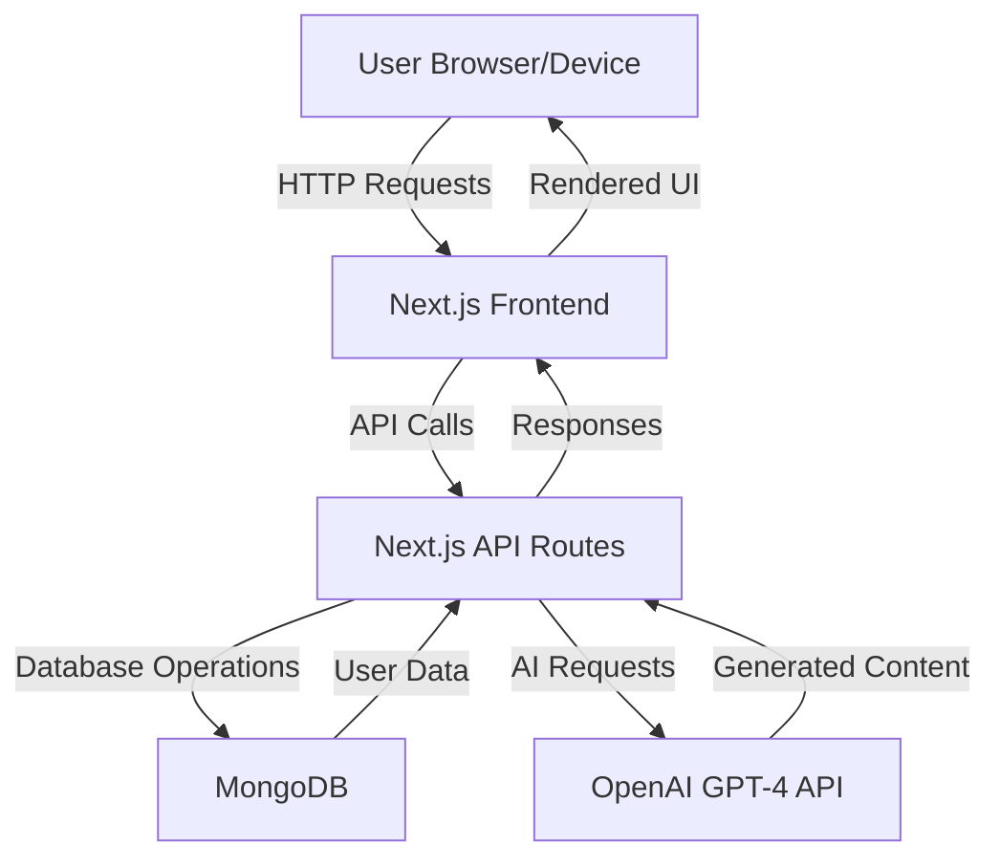
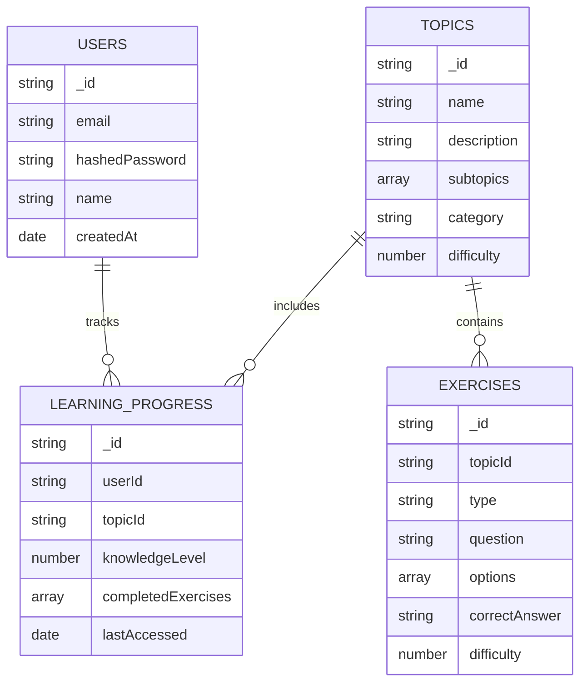
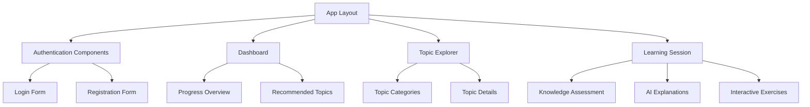

# Simplified Implementation Plan for Lernai

## 1. Project Overview

Lernai is an AI-powered learning application that provides personalized learning experiences based on the user's knowledge level and chosen topics. The app will use Next.js for both frontend and backend, MongoDB for data storage, and OpenAI's GPT-4 API for generating personalized learning content.

## 2. System Architecture

## 3. Core Database Schema

## 4. Simplified Implementation Phases

### Phase 1: Project Setup and Authentication (1 week)

1. **Environment Setup**
   - Configure MongoDB connection
   - Set up OpenAI API integration
   - Configure environment variables

2. **Basic Authentication System**
   - Implement user registration
   - Implement login/logout functionality
   - Create protected routes

### Phase 2: Core Learning Features (2 weeks)

1. **Topic Management**
   - Create topic selection interface
   - Implement basic topic search
   - Design simple topic detail pages

2. **Knowledge Assessment**
   - Implement self-assessment questionnaire
   - Create simple knowledge level determination

3. **AI-Generated Learning Content**
   - Implement OpenAI GPT-4 API integration
   - Create prompts for generating explanations
   - Design basic content presentation

4. **Interactive Exercises**
   - Implement multiple choice exercises
   - Create simple exercise evaluation logic

### Phase 3: Progress Tracking (1 week)

1. **Basic Progress Tracking**
   - Implement simple learning progress dashboard
   - Create basic progress indicators

2. **Simple Repetition System**
   - Implement basic spaced repetition logic
   - Design simple review sessions

## 5. Technical Implementation Details

### Frontend Components

### Backend API Routes

1. **Authentication API**
   - `/api/auth/register` - User registration
   - `/api/auth/login` - User login
   - `/api/auth/logout` - User logout

2. **Topics API**
   - `/api/topics` - Get all topics
   - `/api/topics/[id]` - Get specific topic

3. **Learning API**
   - `/api/learning/assessment` - Get/submit knowledge assessment
   - `/api/learning/explanation` - Get AI-generated explanations
   - `/api/learning/exercises` - Get/submit exercises
   - `/api/learning/progress` - Get/update learning progress

4. **AI Integration API**
   - `/api/ai/generate-explanation` - Generate topic explanation
   - `/api/ai/generate-exercise` - Generate exercise
   - `/api/ai/evaluate-answer` - Evaluate user's answer

## 6. Required Dependencies

1. **Core Dependencies**
   - `next` - Next.js framework
   - `react` & `react-dom` - React library
   - `typescript` - TypeScript support
   - `tailwindcss` - Styling

2. **Database & Authentication**
   - `mongodb` - MongoDB driver
   - `mongoose` - MongoDB object modeling
   - `next-auth` - Authentication for Next.js
   - `bcrypt` - Password hashing

3. **AI Integration**
   - `openai` - OpenAI API client

4. **UI Components**
   - `@headlessui/react` - Accessible UI components
   - `@heroicons/react` - Icon set
   - `react-hook-form` - Form handling

## 7. OpenAI GPT-4 Integration Details

The integration with OpenAI's GPT-4 API will be central to providing personalized learning content. Here's how it will be implemented:

1. **Explanation Generation**
   - Input: Topic, user's knowledge level, preferred learning style
   - Output: Personalized explanation of the topic
   - Example prompt: "Explain [topic] at a [knowledge level] level. Focus on [key aspects] and use [learning style] approach."

2. **Exercise Generation**
   - Input: Topic, knowledge level, exercise type (multiple choice, free text)
   - Output: Question, answer options (for multiple choice), correct answer
   - Example prompt: "Create a [difficulty level] [exercise type] question about [topic] with [number] answer options."

3. **Answer Evaluation**
   - Input: Question, user's answer, correct answer
   - Output: Correctness assessment, explanation of mistakes, tips for improvement
   - Example prompt: "Evaluate this answer: [user answer] for the question: [question]. The correct answer is: [correct answer]. Provide feedback and tips for improvement."

4. **API Implementation**
   - Create a wrapper service for OpenAI API calls
   - Implement caching to reduce API calls for common topics
   - Add error handling and fallback content

## 8. Development Approach

1. **Iterative Development**
   - Start with minimal viable features
   - Implement core functionality first
   - Add enhancements in subsequent iterations

2. **Simple Deployment**
   - Deploy to Vercel for hosting
   - Use MongoDB Atlas for database

3. **Basic Testing**
   - Manual testing of core functionality
   - Simple unit tests for critical components

This simplified plan focuses on the essential features needed for a functional learning application, without the overhead of extensive testing, marketing, or complex features. Once the core functionality is implemented and working, we can iterate and add more sophisticated features based on feedback and requirements.